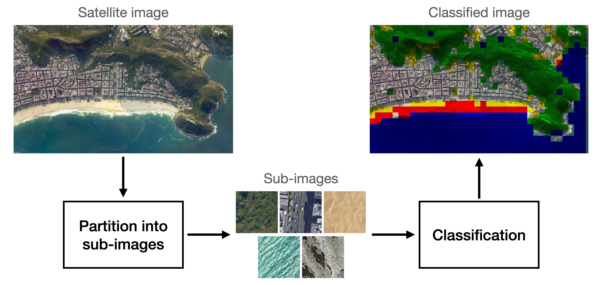
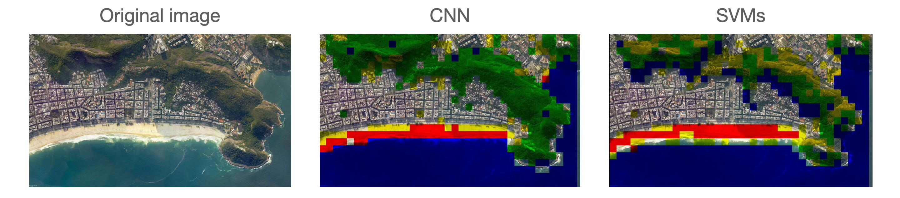

# Classification of Satellite Images based on their Type of Terrain

**Satellite image classification system:** The satellite image is partitioned into sub-images, which then are classified into four different terrain types: forest, city, desert, mountain, and water bodies.
 

This repository contains the code for the paper titled "Classification of Satellite Images based on their Terrain Type".

## Description

Satellite image classification and analysis has many important applications in the real world. For example, it can be used to track deforestation and desertification levels, glacier movements, and even the expansion of cities. We propose a satellite image analysis algorithm based on sub-image classification. The proposed algorithm can identify up to five different terrain types: forest city, desert, mountain and water bodies. We also train and compare the classification accuracy of four common machine learning algorithms and one based on deep learning. The dataset used to train and test the models consists of images captured from Google Earth at different heights. The algorithm with the best performance is selected for the task of satellite image analysis. This paper was written as part of the project for the course "MT0017 Mechatronics Topics: Machine Learning", taught by Oscar Ramos at UTEC.

### 1. Dataset

Google Earth Pro was used to acquire images of five different terrain types: forest, city, desert, mountains and water. The images use JPEG format and have dimensions of 4800 × 2823 pixels. Each image is subdivided into 814 square sub-images with side length of 128 pixels. In total, the dataset contains 106623 sub-images of the five terrain classes, where 80% were used for training and validation, and the remaining 20% were used for testing. Additionally, the model was also tested using three new satellite images with mixed terrain types. These new images contain the terrain types found on the training set. In total, the new images contain 2442 sub-images.

### 2. Algorithm

In this project, we propose a satellite image analysis algorithm based on sub-image classification. The algorithm consists of three stages: image partition, feature extraction, and classification.

#### 2.1. Image partition

In the first stage, the satellite images are partitioned into sub-images with dimensions of 128 × 128 pixels. Complete satellite images may contain different types of terrains, but smaller sub-images have a higher probability of having only a single type. By having a single class of terrain in a sub-image, we assume that its color and texture correspond to a single class of terrain, which is ideal for the classification stage.

#### 2.2. Feature extraction

The feature extraction stage is different depending on the classification model being used. When using classic machine learning algorithms, such as support vector machines (SVM), multi layer perceptrons (MLP), naive Bayes, and random forests, a manual feature extraction stage is used to create a low-dimensional representation of the image. In contrast, when using deep learning models, such as convolutional neural networks (CNN), the model learns the optimal feature extraction parameters by itself in the training stage.

In manual feature extraction, we use both color and texture features. Color features are computed by taking the mean and variance of each color channel in the sub-image. Also, we use principal component analysis (PCA) to find the loading vectors of each sub-image, and use the coefficients of the first and second loading vectors with the highest variance as inter-channel color descriptors. Texture features are computed using Haralick texture features, which consist of 13 statistical parameters computed from the gray-level coocurrance matrix (GLCM). Haralick texture features are used to describe the relationship between the intensity of adjacent pixels, which is associated to the texture of images. In total, manual feature extraction produces 24 color and 13 texture features.

In contrast, the feature extraction stage used by the CNN is composed of four convolution and max pooling layers each. The coefficients of the convolution kernels are learned by the model in the training stage using gradient descent, which finds the optimal values of the kernels using numerical optimization. In total, the CNN feature extraction stage produces 2304 features by flattening the set of images generated in the last max pool layer.

#### 2.3. Classification

The classification stage consists of a using one or more models in order to map the features into probabilities or classes, depending on the model. With SVMs, a one-vs-all approach was used, since SVMs are constraint to binary classification problems. For all other classifiers, a multiclass approach was selected, since they are inherently support binary classification. In the training stage, all models were trained using cross validation and their hyperparameters were optimized to maximize the F1-score.

#### 2.4. Terrain analysis

After training the model, terrain analysis is performed by simply counting the number of sub-images classified for each terrain class. Temporal variations in the terrain can then be identified by comparing data from different points in time.

### 3. Results

The performance of each classifier was tested using the F1-score. The classifier with the highest overall performance were the SVMs (98.2%), followed by the MLP (98.0%), random forrest (97.8%), CNN (96.7%), and naive Bayes (79.2%). These initial results appear to demostrate that the SVMs are the optimal classifier for the satellite image classification problem. However, when using the three new images with multiple terrain classes, the CNN has the best performance.

One possible explanation to this observation could be that the distribution of the new sub-images is slightly different to the distribution of the trainin set. In this case, the CNN might be able to generalize better to sub-images from different distributions, which is a highly sought after trait in classification algorithms. Because of this, we conclude that the best classifier could be either the SVMs or the CNN, depending on the specific satellite image classifiaction problem.
